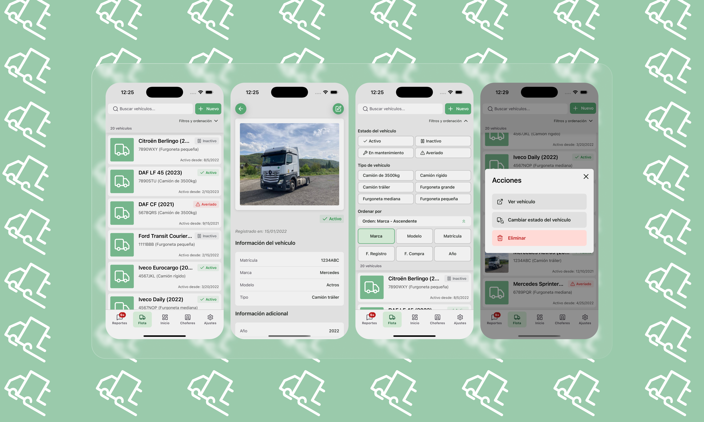
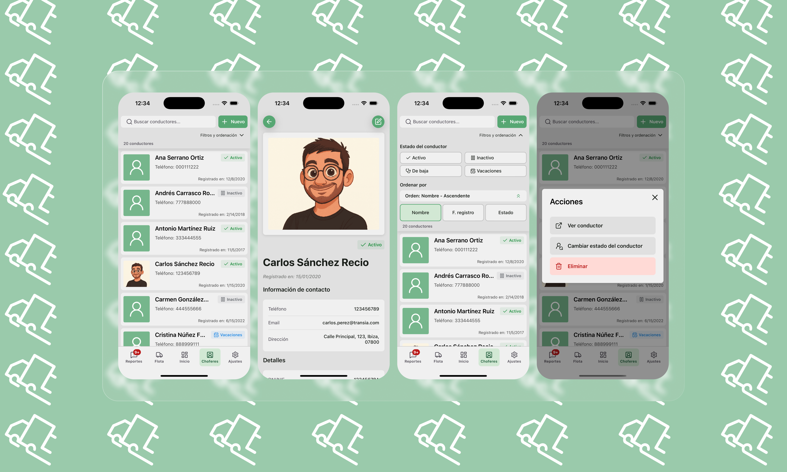
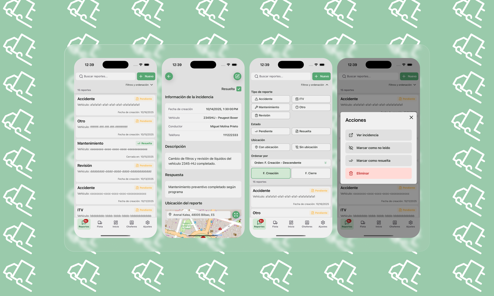
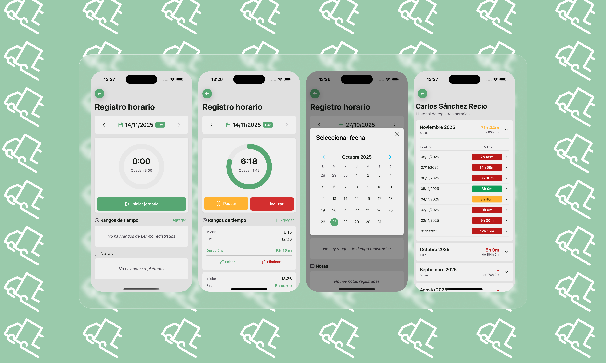

# 🚚 Transia MVP – Fleet Management System

**Transia** is a mobile application designed for **transport fleet management** and **staff time registration**. It enables drivers and managers to efficiently manage incidents, vehicle assignments, maintenance alerts, time schedule tracking, and overall fleet operations from a single, powerful mobile platform.


---

## 📋 Table of Contents

-  [Overview](#-overview)
-  [Key Features](#-key-features)
-  [Tech Stack](#%EF%B8%8F-tech-stack)
-  [Getting Started](#-getting-started)
-  [Project Structure](#-project-structure)
-  [User Roles](#-user-roles)
-  [Contributing](#-contributing)
-  [License](#-license)

---

## 🎯 Overview

Transia MVP solves critical fleet management challenges by providing:

-  **Real-time fleet visibility** - Know the status of all vehicles and drivers at a glance.
-  **Centralized incident tracking** - Log and manage maintenance issues, accidents, and inspections with photo evidence and GPS location.
-  **Time schedule tracking** - Register every staff time entry and track work hours, breaks, and historical time records.
-  **Driver accountability** - Track work hours, breaks, and historical time records.
-  **Preventive maintenance** - ITV (technical inspection) alerts and maintenance scheduling.
-  **Mobile-first approach** - Drivers can report issues and track time directly from the field.
-  **Role-based access control** - Different permissions for administrators, managers, and drivers.

---

## ✨ Key Features

### 🚗 Fleet Management

-  **Complete vehicle inventory** with detailed profiles (brand, model, year, license plate, type).
-  **Vehicle status tracking** (Active, Inactive, In Maintenance, Broken Down).
-  **Advanced filtering and search** by brand, model, plate, status, and type.
-  **Multi-criteria sorting** (registration date, purchase date, year).
-  **Photo documentation** for each vehicle.
-  Support for multiple vehicle types: Trailer Trucks, Rigid Trucks, 3500kg Trucks, Vans (Small/Medium/Large).



### 👥 Driver Management

-  **Comprehensive driver profiles** with personal details, contact info, and license data
-  **Driver status management** (Active, Inactive, Sick Leave, Holidays)
-  **Profile photos** and document storage
-  **Advanced search and filtering** by name, ID, or status
-  **Role-based permissions** (Admin, Manager, Driver)
-  **Privacy controls** for sensitive information (DNI, address, phone)



### 📝 Incident & Report Management

-  **Multiple report types**: Accidents, Maintenance, Safety Checks, ITV Notices, Other Issues
-  **GPS location tracking** with automatic address lookup via reverse geocoding
-  **Photo attachments** (multiple images per report)
-  **Link reports to specific drivers and vehicles**
-  **Status tracking** (Open/Closed) with read/unread marking
-  **Timestamps** for creation, read, and closure events
-  **Full-text search** across descriptions and comments
-  **Advanced filtering** by type, location, and status



### ⏱️ Time Tracking & Registration

-  **Daily time tracking** with start/stop functionality
-  **Multiple time ranges per day** (for breaks and pauses)
-  **Real-time clock display** during active work sessions
-  **Manual time entry editing** (add, edit, delete time ranges)
-  **Total hours calculation** per day with circular progress visualization
-  **Monthly time history** with expandable accordions
-  **Expected vs. actual hours tracking**
-  **Notes and comments** per day
-  **Calendar navigation** for easy date selection



### ⚙️ User Settings

-  **Theme selection** (Light/Dark modes with system theme support)
-  **Multi-language support** (Spanish, English, French, Portuguese, Italian, German - in development)
-  **Account management** and logout
-  **Support resources**: About, Terms & Conditions, Privacy Policy

---

## 🛠️ Tech Stack

This project is built with modern, production-ready technologies:

### **Frontend**

-  **[Expo](https://expo.dev/)** (~54.0.12) - Build and deployment platform
-  **[React Native](https://reactnative.dev/)** (0.81.4) - Cross-platform mobile framework
-  **[React 19](https://react.dev/)** (19.1.0) - Latest React with React Compiler enabled
-  **[TypeScript](https://www.typescriptlang.org/)** (~5.9.2) - Type-safe development
-  **[Expo Router](https://docs.expo.dev/router/introduction/)** (~6.0.10) - File-based routing with typed routes

### **Backend & Database**

-  **[Supabase](https://supabase.com/)** (^2.58.0) - PostgreSQL database with serverless architecture
-  **[Expo SQLite](https://docs.expo.dev/versions/latest/sdk/sqlite/)** (~16.0.8) - Local storage for offline capabilities

### **UI & Design**

-  **[React Native Paper](https://callstack.github.io/react-native-paper/)** (^5.14.5) - Material Design 3 components
-  **[Lucide Icons](https://lucide.dev/)** (^0.544.0) - Beautiful, consistent icon library
-  **[React Native Calendars](https://github.com/wix/react-native-calendars)** (^1.1313.0) - Calendar components with Spanish locale

### **State Management & Validation**

-  **[Zustand](https://zustand-demo.pmnd.rs/)** (^5.0.8) - Lightweight state management
-  **[Zod](https://zod.dev/)** (^3.25.76) - TypeScript-first schema validation

### **Maps & Location**

-  **[Expo Location](https://docs.expo.dev/versions/latest/sdk/location/)** (~19.0.7) - GPS and location services
-  **[React Native Leaflet](https://github.com/react-native-leaflet-view/react-native-leaflet-view)** (^1.1.2) - Interactive maps

### **Media & Device Features**

-  **[Expo Image Picker](https://docs.expo.dev/versions/latest/sdk/imagepicker/)** (~17.0.8) - Camera and photo library access
-  **[Expo Image](https://docs.expo.dev/versions/latest/sdk/image/)** (~3.0.8) - Optimized image component
-  **[Expo Haptics](https://docs.expo.dev/versions/latest/sdk/haptics/)** (~15.0.7) - Haptic feedback

### **Development & Testing**

-  **Environment Modes**: Development, Test (with mock data), Production
-  **Debug Panel**: Built-in debugging tools (toggleable)
-  **Mock Data System**: JSON-based mock data for testing without backend
-  **ESLint**: Code quality and consistency
-  **Expo New Architecture**: Enabled for performance improvements
-  **React Compiler**: Experimental React compiler enabled

---

## 👥 Contributing

Contributions are welcome! Whether it's bug fixes, new features, or documentation improvements, your help is appreciated ❤️.

### How to Contribute

Follow these instructions to contribute to the project otherwise your PR will not be considered:

1. **Fork the repository**
2. **Create a feature branch**
   ```bash
   git checkout -b feature/amazing-feature
   ```
3. **Commit your changes**
   ```bash
   git commit -m 'Add some amazing feature'
   ```
4. **Push to the branch**
   ```bash
   git push origin feature/amazing-feature
   ```
5. **Open a Pull Request**

### Guidelines

-  Follow the existing code style and conventions.
-  Write clear, descriptive commit messages.
-  Add tests for new features when applicable.
-  Update documentation as needed.
-  Ensure all tests pass before submitting PR.

### Reporting Issues

If you find a bug or have a suggestion:

-  Open an **[Issue](https://github.com/yourusername/transia-mvp/issues)** with a clear description.
-  Include steps to reproduce (for bugs).
-  Add screenshots if applicable.

---

## 📜 License

This project is distributed under the **GPL v3 - Non-Commercial Use** license.

### What you CAN do:

✅ View, use, and modify the code for personal or educational purposes ✅ Submit **issues** and **pull requests** to improve the project ✅ Fork the project for learning and experimentation

### What you CANNOT do:

❌ Use this code for **commercial purposes** without permission ❌ Redistribute it as a paid product or service ❌ Remove or modify license attributions

### Commercial Use

For commercial licensing, partnerships, or enterprise deployments, please **contact me** to discuss licensing options.

---

<div align="center" style="font-family: -apple-system, BlinkMacSystemFont, 'Segoe UI', Roboto, 'Helvetica Neue', Arial; line-height: 1.25;">
  <p style="margin: 6px 0 2px 0; font-size: 0.95rem; color: #4b5563">
    <strong>Transia</strong> — Fleet and Staff Management Application
  </p>

  <p style="margin: 2px 0; font-size: 0.87rem; color: #4b5563;">
    Built with <strong>Expo</strong> · <strong>React Native</strong> · <strong>Supabase</strong>
  </p>

  <p style="margin: 6px 0 0 0; font-size: 0.78rem; color: #6b7280;">
    © 2025 Transia (<a target="_blank" href="https://github.com/charlymech" style="color: #2563eb; text-decoration: none;">Carlos Sánchez Recio - CharlyMech</a>). All rights reserved. • Licensed under <a href="./LICENSE.md" style="color: #2563eb; text-decoration: none;">GPL v3 - Non-Commercial Use</a>
  </p>
</div>

<!-- <p align="center">
  Made with ❤️ for fleet management professionals
</p>

<p align="center">
  <sub>Built with Expo • React Native • Supabase</sub>
</p> -->
