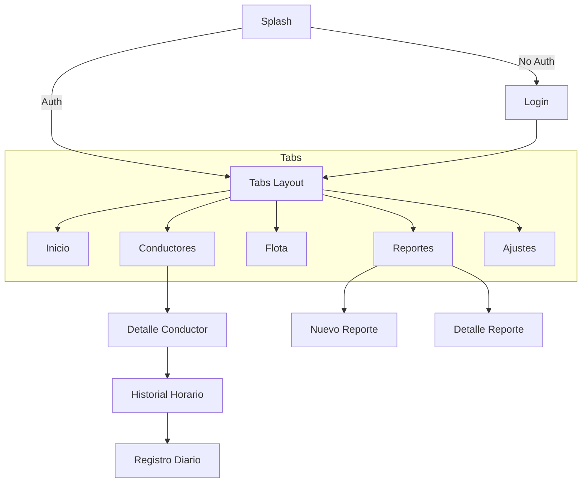

# Flujo de la Aplicación y Navegación

Este documento describe el flujo de usuario y la estructura de navegación de la aplicación Transia MVP.

## Estructura General

La aplicación utiliza `expo-router` para la navegación basada en archivos. La estructura principal se divide en:

1.  **Autenticación**: Pantallas de Login y Onboarding.
2.  **Navegación Principal (Tabs)**: Layout principal con 5 pestañas:
    *   Inicio
    *   Conductores
    *   Flota
    *   Reportes
    *   Ajustes
3.  **Pantallas de Detalle**: Vistas específicas para conductores, reportes, etc.

## Flujo de Usuario

### 1. Autenticación
*   **Splash Screen**: Carga inicial y verificación de sesión.
*   **Login**: Si no hay sesión, el usuario debe ingresar sus credenciales.
*   **Inicio**: Al autenticarse, el usuario es redirigido a la pestaña de Inicio (`/(tabs)/index`).

### 2. Navegación por Pestañas

#### a. Inicio
*   Resumen de actividad.
*   Accesos directos a funciones comunes.

#### b. Conductores (`/drivers`)
*   **Lista**: Vista de todos los conductores con filtros por estado y búsqueda.
*   **Detalle** (`/drivers/[id]`): Información completa del conductor (contacto, licencia).
    *   **Historial Horario** (`/drivers/[id]/time-history`): Registro de horas trabajadas desgajado por mes.
    *   **Registro Horario** (`/drivers/[id]/time-registration`): Vista diaria para gestionar horas, pausas y notas.

#### c. Flota (`/fleet`)
*   Lista de vehículos disponibles y su estado.

#### d. Reportes (`/reports`)
*   **Lista**: Historial de incidencias y reportes.
*   **Nuevo Reporte** (`/reports/new-report`): Formulario para crear incidencias, incluyendo fotos y ubicación.
*   **Detalle** (`/reports/[id]`): Vista de lectura de un reporte específico.

#### e. Ajustes (`/settings`)
*   Configuración de perfil, notificaciones y cierre de sesión.

## Diagrama de Navegación (Simplificado)

