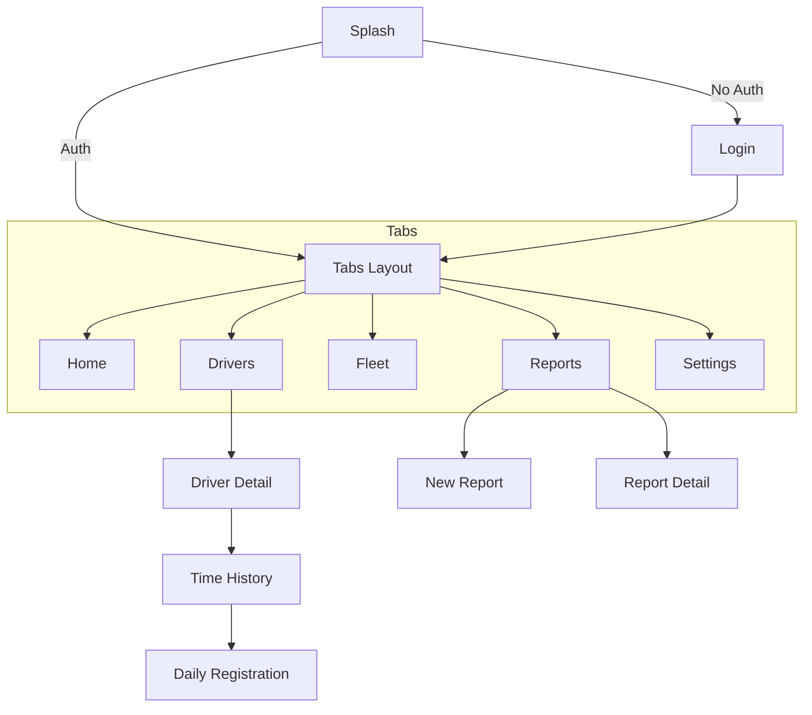

# App Flow & Navigation

This document describes the user flow and navigation structure of the Transia MVP application.

## General Structure

The application uses `expo-router` for file-based navigation. The main structure is divided into:

1.  **Authentication**: Login and Onboarding screens.
2.  **Main Navigation (Tabs)**: Main layout with 5 tabs:
    *   Home (Index)
    *   Drivers
    *   Fleet
    *   Reports
    *   Settings
3.  **Detail Screens**: Specific views for drivers, reports, etc.

## User Flow

### 1. Authentication
*   **Splash Screen**: Initial load and session verification.
*   **Login**: If no session, user must enter credentials.
*   **Home**: Upon authentication, user is redirected to the Home tab (`/(tabs)/index`).

### 2. Tab Navigation

#### a. Home
*   Activity summary.
*   Shortcuts to common functions.

#### b. Drivers (`/drivers`)
*   **List**: View all drivers with status filters and search.
*   **Detail** (`/drivers/[id]`): Complete driver info (contact, license).
    *   **Time History** (`/drivers/[id]/time-history`): Work hours log broken down by month.
    *   **Time Registration** (`/drivers/[id]/time-registration`): Daily view to manage hours, breaks, and notes.

#### c. Fleet (`/fleet`)
*   List of available vehicles and their status.

#### d. Reports (`/reports`)
*   **List**: History of incidents and reports.
*   **New Report** (`/reports/new-report`): Form to create incidents, including photos and location.
*   **Detail** (`/reports/[id]`): Read view of a specific report.

#### e. Settings (`/settings`)
*   Profile configuration, notifications, and logout.

## Navigation Diagram (Simplified)

